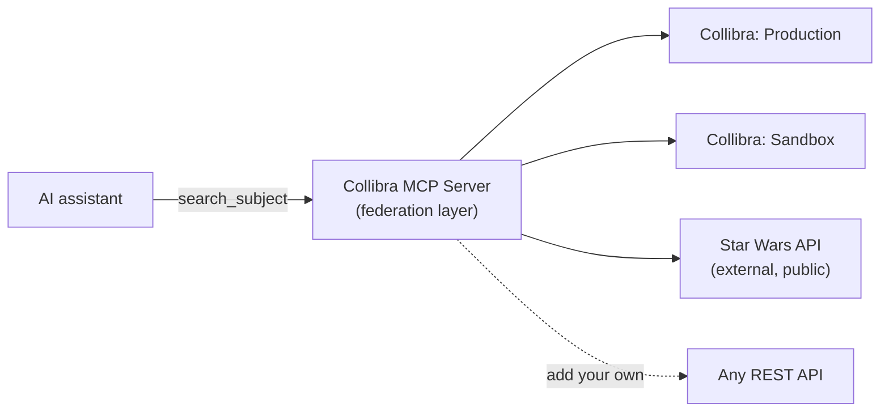

# Collibra MCP Server

A [Model Context Protocol](https://modelcontextprotocol.io/) (MCP) server for Collibra. Connect any MCP-compatible AI assistant (Claude Desktop, VS Code Copilot, etc.) to one or more Collibra instances to search, explore, and update your data catalog through natural language.

## Features

- **Not just Collibra — a true multi-API federation layer.** A single MCP server can integrate *many* APIs, not only Collibra ones. It ships with the public [Star Wars API](https://www.swapi.tech) built in as a live proof point, so `search_subject` can answer a question from **every configured Collibra instance _and_ an external public API in one call**. Add your own REST APIs the same way. ([details below](#not-just-collibra-multi-api-federation))
- **70 tools** covering discovery, governance, semantic traversal, lineage, asset creation, operating model management, operating model intelligence, API catalog traversal, data classification, data contracts, assessments, bulk operations, write operations, and multi-source federation (including the public Star Wars API)
- **Multi-instance** support — connect to production, dev, and UAT simultaneously
- **REST + GraphQL** — uses whichever Collibra API is best for each operation
- **Full user name resolution** — responsibilities show real names and emails, not UUIDs
- **Inherited responsibilities** — see who is responsible at asset, domain, and community levels
- **Semantic traversal** — trace Table → Column → Data Attribute → Business Term and back, or start from a Column or Measure directly
- **Technical lineage** — upstream/downstream data flow analysis with transformation SQL/script retrieval
- **Asset & term creation** — two-step `prepare` + `create` workflow for any asset type or business term
- **Operating model intelligence** — cache the full operating model once (`refresh_operating_model`), then use `describe_asset_type`, `find_traversal_path`, `validate_against_model`, and `plan_asset_creation` for customer-agnostic guidance without extra API calls
- **Bulk operations** — `bulk_create_assets`, `bulk_create_relations`, `bulk_delete_assets`, `bulk_delete_relations` replace N singleton calls with 1–2 API round trips; all with preview/confirm safety
- **Compound asset editing** — `edit_asset` applies a list of typed ops (attribute updates, property changes, relation add/remove) to a single asset in one tool call
- **Data classification** — search data classes, add/remove classification matches on assets
- **Data contracts** — list, pull, and push data contract manifests
- **Assessments** — list, retrieve, create, update, and retake assessments; browse templates and attachments (integrates with the Collibra Assessments REST API at `/rest/assessments/v2`)
- **Read-only mode** — set `"readOnly": true` in `config.json` to hide all write tools from the AI entirely; safe by default
- **Two-step safety for writes** — all update/create/delete tools preview changes before applying them (when read-only mode is off)
- **Clickable URLs** — all responses include direct links to assets, domains, and communities in Collibra
- **AI Use Case assessments** — retrieve assessments linked to any AI Use Case asset by its UUID; read full Q&A content, create new assessments, and submit them
- **Structured tool output** — every tool ships an MCP `outputSchema` and returns `structuredContent` alongside the human-readable text, so structured-aware clients can parse responses directly without re-parsing JSON out of the text block

## Not Just Collibra: Multi-API Federation

> **This server is a federation layer, not a single-API wrapper.** One MCP server can front *multiple* back-end APIs at once — Collibra instances **and** arbitrary external REST APIs — and present them to an AI assistant as one unified tool surface.

To prove the point out of the box, the server integrates the public **[Star Wars API](https://www.swapi.tech)** (no API key required) right alongside your Collibra instances. Ask an assistant about a subject and the server fans the query out to **every source in parallel**, grouping the results by source. A failure in any one source never blocks the others.



Two tools showcase the pattern:

| Tool | What it does |
|------|--------------|
| `search_subject` | **Federated search** — fans one query across **all Collibra instances + the Star Wars API** in a single call, grouping hits by source and tagging each `collibra` or `starwars`. Per-source failures are isolated. |
| `search_star_wars` | Searches only the Star Wars API (people, planets, starships, vehicles, species, films). |

The Star Wars source is **enabled by default** and configured under the optional `externalSources` block in `config.json` (see [Configuration](#beyond-collibra-external-sources)). The same registration pattern extends to any additional public or internal REST API — Collibra is simply the first, richest integration, not the only one.

## Available Tools

### Multi-Source Federation

| Tool | Description |
|------|-------------|
| `search_subject` | Federated search across **every Collibra instance + the Star Wars API** in one call; results grouped by source, per-source failures isolated |
| `search_star_wars` | Search the public Star Wars API only (people, planets, starships, vehicles, species, films) |

### Discovery & Navigation

| Tool | Description |
|------|-------------|
| `get_asset_types` | List all asset type definitions (Data Set, Column, Table, etc.) |
| `get_asset_statuses` | List all workflow statuses and their UUIDs (Candidate, Accepted, Deprecated, etc.) |
| `get_communities` | List communities with automatic hierarchy building |
| `get_domains` | List domains, optionally filtered by community |
| `get_domain_types` | List all domain types and their UUIDs (Glossary, Physical Data Dictionary, etc.) |
| `get_relation_types` | Discover relationship types (filter by source/target type, role) |
| `get_api_catalog` | Traverse the REST API catalog hierarchy: REST API → Version → Endpoint → Operation |

### Search & Retrieval

| Tool | Description |
|------|-------------|
| `search_assets_by_name` | Advanced POST search with keyword matching and filters (resource type, community, domain, domain type, status, created-by) |
| `query_assets` | GraphQL-based asset query with automatic pagination |
| `get_asset_by_id` | Full asset details via GraphQL: all attributes, relations (cursor-paginated), and responsibilities |

### Relationships & Governance

| Tool | Description |
|------|-------------|
| `get_asset_relations` | All incoming/outgoing relationships via GraphQL with cursor pagination |
| `get_asset_responsibilities` | Responsibility analysis with role/owner grouping and inheritance |
| `get_attribute_types` | Discover attribute types and their IDs (filter by name or kind) |

### Asset Creation

| Tool | Description |
|------|-------------|
| `prepare_create_asset` | Pre-flight check before creating an asset — resolves type/domain, checks for duplicates |
| `create_asset` | Create any Collibra asset with optional attribute values *(write)* |

### Business Term Creation

| Tool | Description |
|------|-------------|
| `prepare_add_business_term` | Pre-flight check before adding a business term — resolves domain, checks for duplicates |
| `add_business_term` | Create a Business Term with optional definition and attributes *(write)* |

### Operating Model Management

| Tool | Description |
|------|-------------|
| `create_community` | Create or find a community / sub-community — idempotent *(write)* |
| `create_domain` | Create or find a domain inside a community — idempotent *(write)* |
| `create_relation` | Create a typed relationship between two assets — idempotent *(write)* |
| `create_asset_type` | Create an asset type in the operating model — idempotent *(write)* |
| `create_relation_type` | Create a relation type in the operating model — idempotent *(write)* |
| `create_attribute_type` | Create an attribute type (characteristic) in the operating model — idempotent *(write)* |
| `assign_attribute_to_asset_type` | Assign an existing attribute type to an asset type — idempotent *(write)* |

### Data Classification

| Tool | Description |
|------|-------------|
| `search_data_class` | Search data classes from the Collibra Classification service |
| `add_data_classification_match` | Associate a data class with an asset *(write)* |
| `search_data_classification_match` | Search classification matches by asset, status, or classification ID |
| `remove_data_classification_match` | Remove a classification match (preview → confirm) *(write)* |

### Data Contracts

| Tool | Description |
|------|-------------|
| `list_data_contract` | List data contracts with cursor-based pagination |
| `pull_data_contract_manifest` | Download the active manifest for a data contract |
| `push_data_contract_manifest` | Upload a new data contract manifest version *(write)* |

### Semantic Traversal

| Tool | Description |
|------|-------------|
| `get_table_semantics` | Trace Table → Columns → Data Attributes → Measures |
| `get_business_term_data` | Trace Business Term → Data Attributes → Columns → Tables |
| `get_column_semantics` | Trace Column → Data Attributes → Business Terms / Measures |
| `get_measure_data` | Trace Measure → Data Attributes → Columns → Tables |

### Technical Lineage

| Tool | Description |
|------|-------------|
| `search_lineage_entities` | Find lineage entities by name, type, or DGC asset UUID |
| `get_lineage_entity` | Get details about a single lineage entity |
| `get_lineage_upstream` | Upstream data flow — what feeds into an entity (filterable by type, paginated) |
| `get_lineage_downstream` | Downstream data flow — where an entity's data goes (filterable by type, paginated) |
| `get_lineage_transformation` | Fetch the SQL or script body for a lineage transformation |
| `search_lineage_transformations` | Search lineage transformations by name |

### Assessments

| Tool | Description |
|------|-------------|
| `list_assessments` | List assessments — filter by assetId (e.g. AI Use Case UUID), status, templateId, name, or date range |
| `get_assessment` | Full assessment details: Q&A content, owner, assignees, status, template, dates, and review asset link |
| `get_assessment_by_review` | Reverse lookup — find an assessment by its associated Assessment Review asset UUID |
| `list_assessment_templates` | Browse available templates — filter by name, status, or assetTypeId |
| `get_assessment_template` | Full template details: version, assetType, retakePermission policy, notification settings |
| `list_assessment_attachments` | List file attachments for an assessment (IDs, filenames, upload metadata) |
| `create_assessment` | Create a new assessment linked to an asset, with optional initial Q&A answers *(write)* |
| `update_assessment` | Update status, answers, owner, assignees, or visibility of an assessment *(write)* |
| `retake_assessment` | Start a new revision of a submitted assessment *(write)* |

### Operating Model Intelligence

Cache the operating model once and use these tools for customer-agnostic guidance without extra API calls.

| Tool | Description |
|------|-------------|
| `refresh_operating_model` | Crawl + cache asset types, domain types, attribute types, relation types, and statuses |
| `get_operating_model_summary` | Compact digest of the cached model — asset type families, attribute kind distribution, status names |
| `describe_asset_type` | Full description of an asset type: sub-types, assignable attributes, relation types, eligible statuses |
| `describe_domain_type` | Describe a domain type and its overlapping asset type families |
| `resolve_model_term` | Fuzzy-resolve a free-text term against all model elements; returns ranked candidates with UUIDs |
| `plan_asset_creation` | Plan an asset creation: resolves type + domain, lists assignable attributes, emits a `nextAction` |
| `find_traversal_path` | Find the shortest relation-type path between two asset types in the cached model |
| `validate_against_model` | Pre-flight a proposed write against the cached model; returns violations before any API call |
| `plan_write_operation` | Decision helper — returns the recommended tool (single/bulk/edit_asset) given the kind and count of writes |

### Bulk Operations

| Tool | Description |
|------|-------------|
| `bulk_create_assets` | Create multiple assets in one call — mixed types and domains supported *(write)* |
| `bulk_create_relations` | Create multiple typed relations in one call — idempotent *(write)* |
| `bulk_delete_assets` | Delete multiple assets permanently (preview → confirm) *(write)* |
| `bulk_delete_relations` | Delete multiple relations permanently (preview → confirm) *(write)* |
| `edit_asset` | Apply multiple typed edits to one asset in one call: attribute ops, property changes, relation ops *(write)* |

### Write Operations

| Tool | Description |
|------|-------------|
| `update_asset_description` | Update a single asset's description (preview → confirm) |
| `bulk_update_asset_descriptions` | Update descriptions for multiple assets at once |
| `update_asset_attribute` | Update any attribute on an asset by type ID (preview → confirm) |
| `bulk_update_asset_attributes` | Update any attribute across multiple assets at once |
| `create_asset` | Create any Collibra asset with optional attribute values |
| `bulk_create_assets` | Create multiple assets in one bulk call |
| `add_business_term` | Create a Business Term with optional definition and attributes |
| `create_community` | Create or find a community / sub-community (idempotent) |
| `create_domain` | Create or find a domain inside a community (idempotent) |
| `create_relation` | Create a typed relationship between two assets (idempotent) |
| `bulk_create_relations` | Create multiple typed relations in one bulk call |
| `create_asset_type` | Create an asset type in the operating model (idempotent) |
| `create_relation_type` | Create a relation type in the operating model (idempotent) |
| `create_attribute_type` | Create an attribute type in the operating model (idempotent) |
| `assign_attribute_to_asset_type` | Assign an attribute type to an asset type (idempotent) |
| `add_data_classification_match` | Associate a data class with an asset |
| `remove_data_classification_match` | Remove a classification match (preview → confirm) |
| `push_data_contract_manifest` | Upload a new data contract manifest version |
| `create_assessment` | Create a new assessment linked to an asset or template |
| `update_assessment` | Update status, answers, owner, assignees, or visibility |
| `retake_assessment` | Start a new revision of a submitted assessment |
| `edit_asset` | Multi-op edit on a single asset (attribute updates, property changes, relation ops) |
| `bulk_delete_assets` | Delete multiple assets permanently (preview → confirm) |
| `bulk_delete_relations` | Delete multiple relations permanently (preview → confirm) |

> All write tools use a **preview/confirm** pattern — call with `confirm=false` (default) to see what will change, then `confirm=true` to apply.

## Quick Start

```bash
# 1. Install dependencies
npm install

# 2. Create your configuration
cp config.example.json config.json
# Edit config.json with your Collibra instance URL and credentials

# 3. Build
npm run build

# 4. Run
npm start
```

See [INSTALL.md](INSTALL.md) for detailed setup instructions and MCP client configuration.

## Configuration

Copy `config.example.json` to `config.json` and add your Collibra instances:

```json
{
  "readOnly": true,
  "instances": [
    {
      "name": "Production",
      "baseUrl": "https://your-instance.collibra.com",
      "username": "your-username",
      "password": "your-password"
    }
  ]
}
```

You can add multiple instances and reference them by name when calling any tool.

### `readOnly` Mode

| Value | behavior |
|-------|-----------|
| `true` (default) | Write tools are **hidden from the AI** — they do not appear in the tool list and cannot be called |
| `false` | All 70 tools are available, including the 24 write tools |

Set `"readOnly": false` only when you personally need to make changes, then switch back to `true` when done.

> **Security:** `config.json` is in `.gitignore` — never commit credentials to version control.

### Beyond Collibra: External Sources

The server is a **federation layer**, not just a Collibra wrapper — it can query non-Collibra
REST APIs alongside your Collibra instances. As a built-in illustration, it integrates the
public [Star Wars API](https://www.swapi.tech), so asking an LLM about a subject like
"Luke Skywalker" checks **every configured Collibra instance _and_ the Star Wars API** at once.

External sources are declared in the optional `externalSources` block of `config.json`:

```json
{
  "externalSources": {
    "starWars": {
      "enabled": true,
      "baseUrl": "https://www.swapi.tech/api"
    }
  }
}
```

The Star Wars source is **enabled by default** (omit the block to accept defaults; set
`enabled: false` to turn it off). Two tools use it:

| Tool | What it does |
|------|--------------|
| `search_star_wars` | Searches only the Star Wars API (people, planets, starships, vehicles, species, films) |
| `search_subject` | Federated search: fans out across **all Collibra instances + the Star Wars API** in one call, grouping results by source. A failure in one source never blocks the others. |

This pattern is designed to be extended — additional public or internal REST APIs can be
registered the same way.

## Documentation

| Guide | Description |
|-------|-------------|
| [INSTALL.md](INSTALL.md) | Full installation and MCP client configuration |
| [docs/CLAUDE_DESKTOP_SETUP.md](docs/CLAUDE_DESKTOP_SETUP.md) | Claude Desktop integration step-by-step |
| [docs/TOOLS_REFERENCE.md](docs/TOOLS_REFERENCE.md) | Detailed parameter reference for all 70 tools |

## Project Structure

```
├── src/
│   ├── index.ts                          # MCP server entry point
│   ├── config.ts                         # Configuration loader
│   ├── types.ts                          # TypeScript type definitions
│   ├── tools/
│   │   ├── index.ts                              # Tool registry (70 tools)
│   │   ├── get-asset-types.ts                    # Asset type definitions
│   │   ├── get-communities.ts                    # Community hierarchy
│   │   ├── get-domains.ts                        # Domain listing
│   │   ├── get-relation-types.ts                 # Relationship type discovery
│   │   ├── search-assets-by-name.ts              # POST search with filters
│   │   ├── query-assets.ts                       # GraphQL asset query
│   │   ├── get-asset-by-id.ts                    # Full asset details (GraphQL)
│   │   ├── get-asset-relations.ts                # Asset relations (GraphQL)
│   │   ├── get-asset-responsibilities.ts         # Responsibilities with inheritance
│   │   ├── get-attribute-types.ts                # Attribute type discovery
│   │   ├── prepare-create-asset.ts               # Pre-flight check for asset creation
│   │   ├── create-asset.ts                       # Create any asset (write)
│   │   ├── prepare-add-business-term.ts          # Pre-flight check for business term
│   │   ├── add-business-term.ts                  # Create a Business Term (write)
│   │   ├── search-data-class.ts                  # Search Classification data classes
│   │   ├── add-data-classification-match.ts      # Add classification match (write)
│   │   ├── search-data-classification-match.ts   # Search classification matches
│   │   ├── remove-data-classification-match.ts   # Remove classification match (write)
│   │   ├── list-data-contract.ts                 # List data contracts
│   │   ├── pull-data-contract-manifest.ts        # Download active manifest
│   │   ├── push-data-contract-manifest.ts        # Upload manifest version (write)
│   │   ├── get-table-semantics.ts                # Table → Column → DA → Measure
│   │   ├── get-business-term-data.ts             # Term → DA → Column → Table
│   │   ├── get-column-semantics.ts               # Column → DA → Business Term/Measure
│   │   ├── get-measure-data.ts                   # Measure → DA → Column → Table
│   │   ├── get-lineage-upstream.ts               # Upstream lineage
│   │   ├── get-lineage-downstream.ts             # Downstream lineage
│   │   ├── get-lineage-entity.ts                 # Lineage entity details
│   │   ├── get-lineage-transformation.ts         # Transformation SQL/script
│   │   ├── search-lineage-entities.ts            # Lineage entity search
│   │   ├── search-lineage-transformations.ts     # Transformation search
│   │   ├── list-assessments.ts                   # List assessments (filter by asset, status, template)
│   │   ├── get-assessment.ts                     # Full assessment details + Q&A content
│   │   ├── get-assessment-by-review.ts           # Lookup assessment by review asset UUID
│   │   ├── list-assessment-templates.ts          # Browse assessment templates
│   │   ├── get-assessment-template.ts            # Full template details
│   │   ├── list-assessment-attachments.ts        # List attachments for an assessment
│   │   ├── create-assessment.ts                  # Create assessment (write)
│   │   ├── update-assessment.ts                  # Update assessment (write)
│   │   ├── retake-assessment.ts                  # Retake assessment (write)
│   │   ├── create-community.ts                   # Create community / sub-community (write)
│   │   ├── create-domain.ts                      # Create domain in a community (write)
│   │   ├── create-relation.ts                    # Create typed relation between assets (write)
│   │   ├── create-asset-type.ts                  # Create asset type in operating model (write)
│   │   ├── create-relation-type.ts               # Create relation type in operating model (write)
│   │   ├── get-api-catalog.ts                    # REST API catalog traversal (API → Version → Endpoint → Operation)
│   │   ├── get-asset-statuses.ts                 # List workflow statuses
│   │   ├── get-domain-types.ts                   # List domain types
│   │   ├── update-asset-description.ts           # Single description update
│   │   ├── bulk-update-asset-descriptions.ts     # Bulk description update
│   │   ├── update-asset-attribute.ts             # Single attribute update
│   │   ├── bulk-update-asset-attributes.ts       # Bulk attribute update
│   │   ├── refresh-operating-model.ts            # Crawl + cache operating model snapshot
│   │   ├── get-operating-model-summary.ts        # Compact operating model digest
│   │   ├── describe-asset-type.ts                # Full asset type description from cache
│   │   ├── describe-domain-type.ts               # Domain type description from cache
│   │   ├── resolve-model-term.ts                 # Fuzzy-resolve term to model elements
│   │   ├── plan-asset-creation.ts                # Plan asset creation (no API calls)
│   │   ├── find-traversal-path.ts                # Shortest relation path between asset types
│   │   ├── validate-against-model.ts             # Pre-flight write validation
│   │   ├── plan-write-operation.ts               # Write advisor — pick single/bulk/edit_asset
│   │   ├── bulk-create-assets.ts                 # Bulk asset creation (write)
│   │   ├── bulk-create-relations.ts              # Bulk relation creation (write)
│   │   ├── bulk-delete.ts                        # Bulk asset + relation delete (write)
│   │   ├── edit-asset.ts                         # Multi-op compound edit (write)
│   │   ├── plan-write-operation.ts               # Write advisor — pick single/bulk/edit_asset
│   │   ├── create-attribute-type.ts              # Create attribute type in operating model (write)
│   │   ├── assign-attribute-to-asset-type.ts     # Assign attribute type to asset type (write)
│   │   ├── search-star-wars.ts                   # Search the public Star Wars API (federation demo)
│   │   └── search-subject.ts                     # Federated search across Collibra + Star Wars API
│   │   # (tool registry index.ts registers all 70 tools)
│   └── utils/
│       ├── collibra-client.ts            # REST + GraphQL client with URL helpers
│       ├── swapi-client.ts               # Minimal client for the public Star Wars API
│       ├── operating-model-cache.ts      # Local operating model snapshot store
│       └── tool-result.ts                # `ok` / `okPretty` helpers for structuredContent
├── config.example.json                   # Configuration template
├── package.json
└── tsconfig.json
```

## Prerequisites

- **Node.js** 18+
- Access to a Collibra instance with valid credentials
- An MCP-compatible AI client (Claude Desktop, VS Code with Copilot, etc.)

## License

MIT
